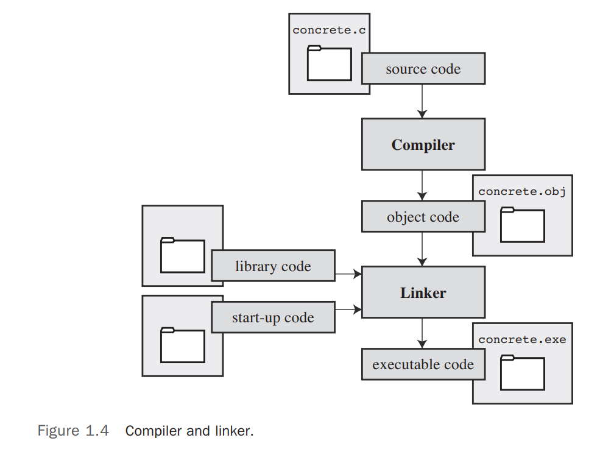

# 1. Getting Ready

## Contents

- C
- What Computers Do
- High-level Language & Compiler
- Using C: 7 Steps
- Programming Mechanics

## Basic info

**History:**

- Created in 1972
- Came from B language

**Virtues:**

- Powerful control structures (associated with an assembly language)
- Fast
- Compact code - small programs
- Portable to other computers (with little or no modification)
  - change a few entries in a header file

Function

- Operating system (Linux)
- languages: Compilers/interpreters(Python)
- Computer games
- PC applications
- Embedded systems: microprocessors in automobiles, cameras,...
- physics, robot, engineering, special effects for movies.

**Programmer Oriented：**

- Gives you access to hardware
- Enables you to manipulate individual bits in memory
- flexibility (less strict): both advantage and a danger
  - **the price of liberty is eternal vigilance**

>many software houses began turning to the **C++** language for large programming projects. C++ grafts object-oriented programming tools to the C language. ( Object-oriented programming is a philosophy that attempts to mold the language to fit a problem instead of molding the problem to fit the language.) C++ is nearly a superset of C, meaning that any C program is, or nearly is, a valid C++ program, too. By learning C, you also learn much of C++.

## How Computers Work

### Components

- **CPU** (Central Processing Unit) 
  - most of the computing work (e.g., process programs)
- **RAM** (Random Access Memory)
  - a workspace to hold programs and files
- **SSD** (Solid State device) or **HD** (Hard Disk)
  - permanent memory storage device
- **peripherals** (keyboard, mouse, touchscreen, and monitor)
  - provide for communication between the computer and you

### What Computers Do

CPU fetches an instruction from memory and executes it. It fetches the next instruction from memory and executes it, and so on. (A gigahertz CPU can do this about a billion times a second).
The CPU has its own small workspace, consisting of several **registers**, each of which can hold a number. One register holds the memory address of the next instruction, and the CPU uses this information to fetch the next instruction. After it fetches an instruction, the CPU stores the instruction in another register and updates the first register to the address of the next instruction. 
The CPU has a limited repertoire of instructions (known as the **instruction set**). many of them ask the computer to move a number from one location to another—for example, from a memory location to a register.

First, everything stored in a computer is stored as a number. 
Second, computer programs ultimately have to be expressed in a numeric instruction code, or what is called **machine language**.

If you want a computer to do something, you have to feed a particular list of instructions (a program) telling it exactly what to do and how to do it. You have to create the program in a language that the computer understands directly (machine language).

**e.g., adding two numbers**:

1. Copy the number in memory location 2000 to register 1.
2. Copy the number in memory location 2004 to register 2.
3. Add the contents of register 2 to the contents of register 1, leaving the answer in register 1.
4. Copy the contents of register 1 to memory location 2008.

### High-level Computer languages and Compilers

Compiler
:  a program that translates the high-level language program into the detailed set of machine language instructions the computer requires.

In general, each computer design has its own unique machine language; so a program written in the machine language for, say, an Intel Core i7 CPU means nothing to an ARM Cortex-A57 CPU. But you can match a compiler to a particular machine language.

### Language Standards

**Guiding Principles**: Keep the spirit of C

- Trust the programmer.
- Don’t prevent the programmer from doing what needs to be done.
- Keep the language small and simple.
- Provide only one way to do an operation.
- Make it fast, even if it is not guaranteed to be portable.

- C99 (1994)
- C11 (2007)

### Using C: Seven Steps

Note that this is an idealization. In practice, particularly for larger projects, you would go back and forth, using what you learned at a later step to refine an earlier step.
For instance, when you are writing code, you might find that your plan was impractical. You may see a better way of doing things or, after you see how a program runs, you might feel motivated to change the design.

1. **Define the program objectives**
   1. thinking in general terms, not in terms of some specific
computer language.
   2. The larger and more complex the job is, the more planning it
requires. 
2. **Design the program**
   1. How the program will go about it?
   2. What should the user interface be like? How should the program be organized?
   3. Who will the target user be?
   4. How much time do you have to complete the program?
   5. How to represent the data in the program?
   6. which methods to use to process the data?
3. **Write the code**
4. **Compile**
5. **Run the program**
6. **Test and debug the program**
   1. Debugging: finding and fixing program errors.
7. **Maintain and modify the program**

### Programming Mechanics

When you write a program in the C language, you store what you write in a text file called a **source code** file. Most C systems, including the ones we mentioned, require that the name of the file end in .c. The part of the name before the period is called the basename, and the part after the period is called the extension.

#### Object Code Files, Executable Files, and Libraries

The basic strategy in C programming is to use programs that convert your source code file to an executable file, which is a file containing ready-to-run machine language code.
C implementations typically do this in two steps: **compiling** and **linking**. The compiler converts your source code to an **intermediate** code, and the linker combines this with other code to produce the **executable** file.
You can compile individual modules separately and then use the linker to combine the compiled modules later. That way, if you need to change one module, you don’t have to recompile the other ones. Also, the linker combines your program with precompiled library code. 
The most prevalent choice for the form of the intermediate files, is to convert the source code to machine language code, placing the result in an object code file, or **object file** for short. (This assumes that your source code consists of a single file.) Although the object file contains machine language code, it is not ready to run. The object file contains the translation of your source code, but it is not yet a complete program.
The first element missing from the object code file is something called **startup code**, which is code that acts as an interface between your program and the operating system. For example, you would need different startup code for Windows than you would for Linux because these systems handle programs differently from one another.
The second missing element is the code for library routines. Nearly all C programs make use of routines (called functions) that are part of the standard C library. For example, concrete.c uses the function printf(). The object code file does not contain the code for this function; it merely contains instructions saying to use the printf() function. The actual code is stored in another file, called a library. A **library file** contains object code for many functions.
The role of the linker is to bring together these three elements—your **object code**, the standard **startup code** for your system, and the **library code**—and put them together into a single executable file. For library code, the linker extracts only the code needed for the functions you use from the library (see Figure 1.4).



In short, an object file and an executable file both consist of machine language instructions. However, the object file contains the machine language translation only for the code you used, but the executable file also has machine code for the library routines you use and for the startup code.
On some systems, you must run the compile and link programs separately. On other systems, the compiler starts the linker automatically, so you have to give only the compile command.

#### Unix System

Compile
: `cc fileName.c` =compile=> `fileName.o`(object file) =linker=> `a.out` 
(if there is only one source file linker will remove `fileName.o`)

GNU (GNU's Not Unix) compiler collection
: GCC compiler: `gcc`

LLVM (UIUC)
: `clang`

#### Linux Systems

a popular open-source, Unix-like operating system that runs on a variety of platforms, including PCs and Macs.

install GCC.

#### Command-Line Compilers for the PC

**Cygwin** and **MinGW** are free downloads that make the GCC compiler available for command-line use on a PC.

C compilers for the PC typically, but not always, produce intermediate object code files having an **.obj** extension. Unlike Unix compilers, these compilers typically don’t remove these files when done. Some compilers produce assembly language files with **.asm** extensions or use some special format of their own.

#### IDE (Integrated Dev Env)

One problem you might encounter is that the window showing the program execution vanishes when the program terminates. If that is the case for you, you can make the program pause until you press the Enter key. To do that, add the following line to the end of the program, just before the return statement:
`getchar();`
Sometimes, depending on how the program functions, there might already be a keystroke waiting. In that case, you’ll have to use getchar() twice:

```c
getchar();
getchar();
```

For example, if the last thing the program did was ask you to enter your weight, you would have typed your weight and then pressed the Enter key to enter the data. The program would read the weight, the first `getchar()` would read the Enter key, and the second `getchar()` would cause the program to pause until you press Enter again.

#### Mac

Mac OS X is built on Unix.
